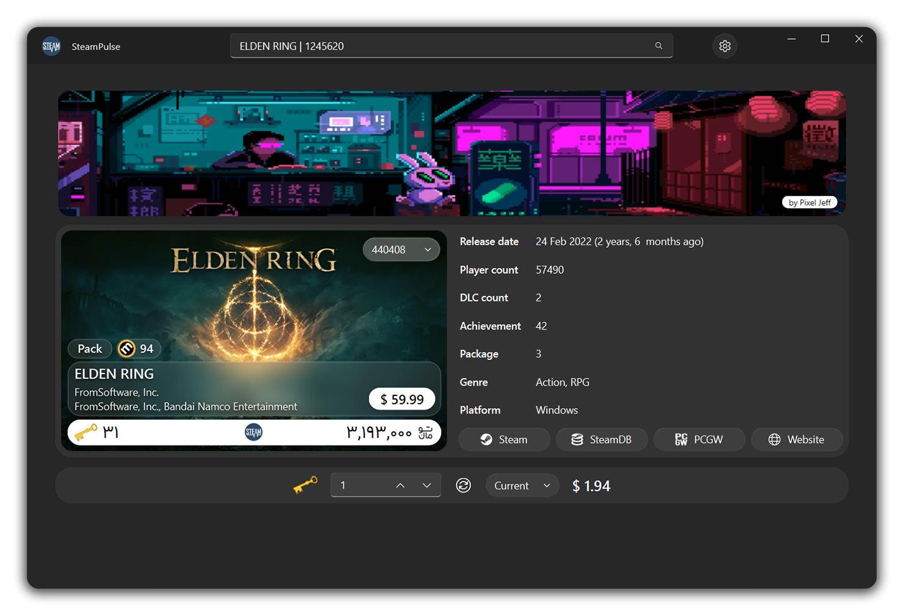

<p align="center">
  
</p>
<p align="center">
  Steam game shop helper
</p>

<p align="center">
  
  
  
</p>

##
<p align="center">
  
</p>

## Install
- Windows
  - Download `SteamPulse_x.x-windows.zip` asset from [releases](https://github.com/AmirMahdaviAM/SteamPulse/releases), extract and run .exe file
  - Or you can procced with below instruction
- Linux, Mac
  - Required `Python 3.10+` (maybe lower, not tested)
  - Clone repo or download repo zip
  ```shell
  git clone https://github.com/AmirMahdaviAM/SteamPulse
  ```
  - Install requirements
  ```shell
  pip install -r requirements.txt
  ```
  - Run app
  ```shell
  python SteamPulse.py
  ```

## Feature
- [x] Support Game, Package and DLC
- [x] Support many regions (USA, UK, EU, Argantine, Ukraine, ...)
- [x] Calculate how many TF2-Key needed based on game pice
- [x] Latest price, information and steam games database
- [x] Exchange between TF2-Key and selected currency
- [x] Show information about Game, Package and DLC

## Known issue
- Not tested in Linux and Mac
- `Open log` button in InfoBar only work in windows

## Thanks to

> [**zhiyiYo**](https://github.com/zhiyiYo) - [PyQt Fluent Widgets](https://github.com/zhiyiYo/PyQt-Fluent-Widgets) and it's gallery app code

> [**Amirhosein Davatgari**](https://github.com/amirhoseindavat) - [Steam Pulse](https://github.com/amirhoseindavat/SteamPulse) original project, inspiration and code help
